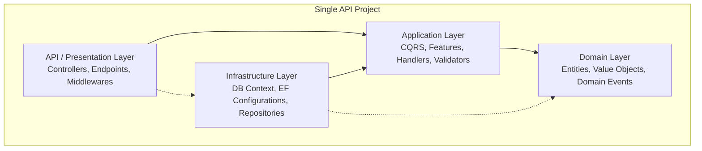

# Arquitectura Limpia en un Solo Proyecto (Clean Architecture + Vertical Slices + CQRS)

Esta guía documenta la estructura, principios y patrones de diseño para el desarrollo de la aplicación utilizando un único proyecto de API (ASP.NET Core), combinando **Clean Architecture** con **Vertical Slices** y **CQRS (Command Query Responsibility Segregation)**.

---

## 1. Introducción y Arquitectura

### ¿Por qué un solo proyecto?
En proyectos tradicionales de Clean Architecture, se suelen crear múltiples proyectos de biblioteca de clases (`Domain`, `Application`, `Infrastructure`, `WebApi`). Esto puede generar:
* Excesiva cantidad de proyectos y sobrecarga en la navegación de la solución.
* Dificultad para mantener la cohesión en torno a una funcionalidad (Features).
* Mayor cantidad de archivos "puente" y mapeos redundantes.

Al utilizar un **único proyecto de API**, mantenemos la separación conceptual utilizando **carpetas y espacios de nombres (namespaces)** para cada capa. Esto reduce la fricción y simplifica la estructura física, manteniendo la misma rigidez en cuanto al acoplamiento de responsabilidades.

### Fusión con Vertical Slice Architecture
En lugar de estructurar todo el código horizontalmente (donde para agregar una característica modificamos archivos en 4 proyectos distintos), agrupamos el código por **Features (Funcionalidades)** en la capa de Aplicación. Cada "Feature" contiene su Command, Query, Handler, Validator y DTOs en una sola carpeta (o un conjunto de archivos estrechamente relacionados).



---

## 2. Estructura de Carpetas

La organización física del proyecto único API se estructura de la siguiente manera:

```text
Api/
│
├── Domain/                         # Capa de Dominio (Sin dependencias externas)
│   ├── Common/                     # Clases base (Entity, ValueObject, etc.)
│   ├── Entities/                   # Entidades de dominio
│   ├── ValueObjects/               # Objetos de Valor
│   ├── Exceptions/                 # Excepciones de dominio
│   └── Repositories/               # Interfaces de Repositorios (definición)
│
├── Application/                    # Capa de Aplicación (Lógica de Negocio)
│   ├── Common/                     # Behaviours de MediatR, Interfaces generales
│   └── Features/                   # Vertical Slices agrupados por Dominio/Entidad
│       └── Products/               # Ejemplo de módulo: Productos
│           ├── CreateProduct/      # Feature: Crear Producto (Command)
│           │   ├── CreateProductCommand.cs
│           │   ├── CreateProductCommandHandler.cs
│           │   ├── CreateProductCommandValidator.cs
│           │   └── CreateProductResponse.cs
│           └── GetProduct/         # Feature: Obtener Producto (Query)
│               ├── GetProductQuery.cs
│               ├── GetProductQueryHandler.cs
│               └── ProductDto.cs
│
├── Infrastructure/                 # Capa de Infraestructura (Efectos secundarios, persistencia)
│   ├── Persistence/                # Base de datos y EF Core
│   │   ├── ApplicationDbContext.cs
│   │   ├── Configurations/         # Mapeos Fluent API de EF Core
│   │   └── Migrations/             # Migraciones generadas por EF
│   └── Services/                   # Implementación de servicios externos (Email, API, etc.)
│
└── Controllers/                    # Capa de Presentación (Controladores / Endpoints)
    ├── ApiControllerBase.cs        # Controlador base con ISender inyectado
    └── ProductsController.cs       # Controlador que expone los endpoints de Productos
```

---

## 3. Capa de Dominio (Domain)

Contiene las reglas del negocio, entidades, objetos de valor y excepciones de dominio. **No debe depender de EF Core, MediatR, ni ninguna librería de infraestructura.**

### 3.1. Clases Base
#### Objetos de Valor (con Vogen)
Para evitar la Primitive Obsession y mantener la inmutabilidad e integridad estructural sin necesidad de escribir código repetitivo (boilerplate), utilizamos la librería **Vogen**. Vogen genera automáticamente los métodos de igualdad, hash code y operadores correspondientes a partir de una estructura parcial decorada con el atributo `[ValueObject<T>]`. 

Por lo tanto, **no se requiere una clase base manual para los objetos de valor.**

#### Entidad Base (`Entity.cs`)
La clase base para las entidades no contiene objetos de valor manuales y se enfoca en indicar cambios reutilizables a través de la gestión de **Eventos de Dominio (Domain Events)**:

```csharp
// Domain/Common/Entity.cs
namespace Api.Domain.Common;

public abstract class Entity<TId>
{
    public TId Id { get; protected set; } = default!;

    private readonly List<object> _domainEvents = new();

    public IReadOnlyCollection<object> DomainEvents => _domainEvents.AsReadOnly();

    protected void AddDomainEvent(object domainEvent)
    {
        _domainEvents.Add(domainEvent);
    }

    public void ClearDomainEvents()
    {
        _domainEvents.Clear();
    }
}
```

### 3.2. Implementación de Objeto de Valor (`Sku.cs`)
Utilizando Vogen, el objeto de valor `Sku` se define como un `partial struct` y se le añade una validación personalizada mediante el método estático privado `Validate`.

```csharp
// Domain/ValueObjects/Sku.cs
using Vogen;

namespace Api.Domain.ValueObjects;

[ValueObject<string>]
public partial struct Sku
{
    private const int DefaultLength = 15;

    private static Validation Validate(string value)
    {
        if (string.IsNullOrWhiteSpace(value) || value.Length != DefaultLength)
        {
            return Validation.Invalid($"El SKU debe tener exactamente {DefaultLength} caracteres.");
        }

        return Validation.Ok;
    }
}
```

### 3.3. Implementación de Entidad (`Product.cs`)
```csharp
// Domain/Entities/Product.cs
using Api.Domain.Common;
using Api.Domain.ValueObjects;

namespace Api.Domain.Entities;

public class Product : Entity<Guid>
{
    public string Name { get; private set; } = string.Empty;
    public string Description { get; private set; } = string.Empty;
    public Sku Sku { get; private set; } = null!;
    public decimal Price { get; private set; }

    // Requerido por EF Core
    private Product() { }

    public Product(Guid id, string name, string description, Sku sku, decimal price)
    {
        Id = id;
        Name = name;
        Description = description;
        Sku = sku;
        Price = price;
    }

    public void UpdateDetails(string name, string description, decimal price)
    {
        Name = name;
        Description = description;
        Price = price;
    }
}
```

---

## 4. Capa de Aplicación (Application)

Implementa los Casos de Uso del negocio utilizando CQRS mediante la librería `MediatR` y validación con `FluentValidation`.

### 4.1. Estructura de una Feature (Vertical Slice)
Cada característica/endpoint se define por completo dentro de su respectiva carpeta bajo `Features`. Tomemos como ejemplo la creación de un producto.

#### 1. El Command (`CreateProductCommand.cs`)
Define los datos necesarios para ejecutar la acción.
```csharp
// Application/Features/Products/CreateProduct/CreateProductCommand.cs
using MediatR;

namespace Api.Application.Features.Products.CreateProduct;

public record CreateProductCommand(
    string Name,
    string Description,
    string Sku,
    decimal Price) : IRequest<Guid>;
```

#### 2. El Handler (`CreateProductCommandHandler.cs`)
Contiene la orquestación lógica para resolver la acción.
```csharp
// Application/Features/Products/CreateProduct/CreateProductCommandHandler.cs
using Api.Domain.Entities;
using Api.Domain.ValueObjects;
using Api.Infrastructure.Persistence;
using MediatR;

namespace Api.Application.Features.Products.CreateProduct;

public class CreateProductCommandHandler : IRequestHandler<CreateProductCommand, Guid>
{
    private readonly ApplicationDbContext _context;

    public CreateProductCommandHandler(ApplicationDbContext context)
    {
        _context = context;
    }

    public async Task<Guid> Handle(CreateProductCommand request, CancellationToken cancellationToken)
    {
        var sku = Sku.Create(request.Sku);
        if (sku == null)
        {
            throw new ArgumentException("El formato del SKU no es válido.");
        }

        var product = new Product(
            Guid.NewGuid(),
            request.Name,
            request.Description,
            sku,
            request.Price
        );

        _context.Products.Add(product);
        await _context.SaveChangesAsync(cancellationToken);

        return product.Id;
    }
}
```

#### 3. El Validador (`CreateProductCommandValidator.cs`)
Valida la integridad y formato de los parámetros de entrada antes de que el Handler sea invocado.
```csharp
// Application/Features/Products/CreateProduct/CreateProductCommandValidator.cs
using FluentValidation;

namespace Api.Application.Features.Products.CreateProduct;

public class CreateProductCommandValidator : AbstractValidator<CreateProductCommand>
{
    public CreateProductCommandValidator()
    {
        RuleFor(x => x.Name).NotEmpty().MaximumLength(100);
        RuleFor(x => x.Description).NotEmpty().MaximumLength(500);
        RuleFor(x => x.Sku).NotEmpty().Length(15);
        RuleFor(x => x.Price).GreaterThan(0);
    }
}
```

---

## 5. Capa de Infraestructura (Infrastructure)

Implementa la persistencia de datos (EF Core), acceso a servicios externos y detalles de infraestructura técnica.

### 5.1. Contexto de Base de Datos (`ApplicationDbContext.cs`)
```csharp
// Infrastructure/Persistence/ApplicationDbContext.cs
using Api.Domain.Entities;
using Microsoft.EntityFrameworkCore;

namespace Api.Infrastructure.Persistence;

public class ApplicationDbContext : DbContext
{
    public ApplicationDbContext(DbContextOptions<ApplicationDbContext> options)
        : base(options)
    {
    }

    public DbSet<Product> Products => Set<Product>();

    protected override void OnModelCreating(ModelBuilder modelBuilder)
    {
        // Aplica automáticamente todas las configuraciones IEntityTypeConfiguration del ensamblado
        modelBuilder.ApplyConfigurationsFromAssembly(typeof(ApplicationDbContext).Assembly);
        
        base.OnModelCreating(modelBuilder);
    }
}
```

### 5.2. Mapeo con Fluent API
Permite que persistamos objetos complejos como Objetos de Valor en columnas primitivas o tablas secundarias sin exponer el diseño relacional a la capa de dominio.
```csharp
// Infrastructure/Persistence/Configurations/ProductConfiguration.cs
using Api.Domain.Entities;
using Api.Domain.ValueObjects;
using Microsoft.EntityFrameworkCore;
using Microsoft.EntityFrameworkCore.Metadata.Builders;

namespace Api.Infrastructure.Persistence.Configurations;

public class ProductConfiguration : IEntityTypeConfiguration<Product>
{
    public void Configure(EntityTypeBuilder<Product> builder)
    {
        builder.HasKey(p => p.Id);

        builder.Property(p => p.Name)
            .IsRequired()
            .HasMaxLength(100);

        builder.Property(p => p.Description)
            .HasMaxLength(500);

        // Mapeo del Objeto de Valor Sku a una sola columna
        builder.Property(p => p.Sku)
            .HasConversion(
                sku => sku.Value,
                value => Sku.Create(value)!)
            .HasColumnName("Sku")
            .IsRequired()
            .HasMaxLength(15);

        builder.Property(p => p.Price)
            .HasColumnType("decimal(18,2)");
    }
}
```

---

## 6. Controladores API (Presentation Layer)

Actúa como punto de entrada de la aplicación HTTP. Delega toda la lógica de negocio a la capa de Aplicación a través de MediatR.

### 6.1. Controlador Base (`ApiControllerBase.cs`)
```csharp
// Controllers/ApiControllerBase.cs
using MediatR;
using Microsoft.AspNetCore.Mvc;

namespace Api.Controllers;

[ApiController]
[Route("api/[controller]")]
public abstract class ApiControllerBase : ControllerBase
{
    private ISender? _mediator;

    protected ISender Mediator => _mediator ??= HttpContext.RequestServices.GetRequiredService<ISender>();
}
```

### 6.2. Controlador de Producto (`ProductsController.cs`)
```csharp
// Controllers/ProductsController.cs
using Api.Application.Features.Products.CreateProduct;
using Microsoft.AspNetCore.Mvc;

namespace Api.Controllers;

public class ProductsController : ApiControllerBase
{
    [HttpPost]
    public async Task<ActionResult<Guid>> Create(CreateProductCommand command)
    {
        var productId = await Mediator.Send(command);
        return Ok(productId);
    }
}
```

---

## 7. Configuración de Inyección de Dependencias

Para mantener `Program.cs` limpio, se configuran las dependencias en extensiones de servicio.

### Registro en Infraestructura y Aplicación (`DependencyInjection.cs`)
```csharp
// DependencyInjection.cs (se puede colocar en Infrastructure o root)
using Api.Infrastructure.Persistence;
using FluentValidation;
using Microsoft.EntityFrameworkCore;

namespace Api;

public static class DependencyInjection
{
    public static IServiceCollection AddInfrastructureServices(this IServiceCollection services, IConfiguration configuration)
    {
        // Configurar base de datos (por ejemplo, InMemory o PostgreSQL/SQLServer)
        services.AddDbContext<ApplicationDbContext>(options =>
            options.UseInMemoryDatabase("CleanArchDb")); // Modificar por la BD real

        return services;
    }

    public static IServiceCollection AddApplicationServices(this IServiceCollection services)
    {
        var assembly = typeof(DependencyInjection).Assembly;

        // Registrar MediatR (escanea el ensamblado del proyecto para encontrar Handlers)
        services.AddMediatR(cfg => cfg.RegisterServicesFromAssembly(assembly));

        // Registrar Validadores de FluentValidation
        services.AddValidatorsFromAssembly(assembly);

        return services;
    }
}
```

Luego, en [Program.cs](file:///C:/Users/Usuario/Desktop/Universidad/U%20SEM5/Aplicaciones%20para%20el%20servidor%20Web/Practicas_Tareas/Tests/Api/Program.cs):
```csharp
// En Program.cs
using Api;

var builder = WebApplication.CreateBuilder(args);

// ...
builder.Services.AddInfrastructureServices(builder.Configuration);
builder.Services.AddApplicationServices();
// ...
```

---

## 8. Librerías Clave Recomendadas (NuGet)

Para implementar esta arquitectura, asegúrese de agregar los siguientes paquetes al proyecto [Api.csproj](file:///C:/Users/Usuario/Desktop/Universidad/U%20SEM5/Aplicaciones%20para%20el%20servidor%20Web/Practicas_Tareas/Tests/Api/Api.csproj):

```xml
<ItemGroup>
  <!-- CQRS y Mediación -->
  <PackageReference Include="MediatR" Version="12.4.0" />
  
  <!-- Validación -->
  <PackageReference Include="FluentValidation.DependencyInjectionExtensions" Version="11.9.0" />
  
  <!-- Acceso a Datos / EF Core -->
  <PackageReference Include="Microsoft.EntityFrameworkCore" Version="9.0.0" />
  <PackageReference Include="Microsoft.EntityFrameworkCore.InMemory" Version="9.0.0" /> <!-- O SQLServer/Postgres -->
  <PackageReference Include="Microsoft.EntityFrameworkCore.Design" Version="9.0.0">
    <PrivateAssets>all</PrivateAssets>
    <IncludeAssets>runtime; build; native; contentfiles; analyzers; buildtransitive</IncludeAssets>
  </PackageReference>
</ItemGroup>
```

## 9. Soluciones Implementadas en el Proyecto

### 9.1. Capa de Dominio (Domain)
Se han estructurado los bloques fundamentales del dominio:
* **Clases Base**:
  * [Entity.cs](file:///C:/Users/Usuario/Desktop/Universidad/U%20SEM5/Aplicaciones%20para%20el%20servidor%20Web/Practicas_Tareas/Tests/Api/Domain/Common/Entity.cs): Abstracción genérica para las entidades del dominio, enfocada en el registro de cambios reutilizables (eventos de dominio) y con soporte para un ID único.
  * *Nota: Se eliminó la clase base manual `ValueObject.cs` para delegar el modelado de los Objetos de Valor a la biblioteca generadora de código Vogen.*
* **Objetos de Valor (Vogen)**:
  * [Email.cs](file:///C:/Users/Usuario/Desktop/Universidad/U%20SEM5/Aplicaciones%20para%20el%20servidor%20Web/Practicas_Tareas/Tests/Api/Domain/ValueObjects/Email.cs): Objeto de valor fuertemente tipado generado automáticamente con Vogen. Encapsula las reglas regex para validar que el formato de correo electrónico sea correcto.
* **Entidades**:
  * [Usuario.cs](file:///C:/Users/Usuario/Desktop/Universidad/U%20SEM5/Aplicaciones%20para%20el%20servidor%20Web/Practicas_Tareas/Tests/Api/Domain/Entities/Usuario.cs): Entidad de dominio que representa al usuario, compuesta por `Id`, `Nombre`, `Apellido` y el objeto de valor struct `Email`. Contiene las validaciones de negocio en su constructor y métodos de actualización.

---

Esto define un diseño limpio, altamente mantenible y adaptado a desarrollos rápidos mediante **Vertical Slices** en un **único proyecto de ASP.NET Core**.
